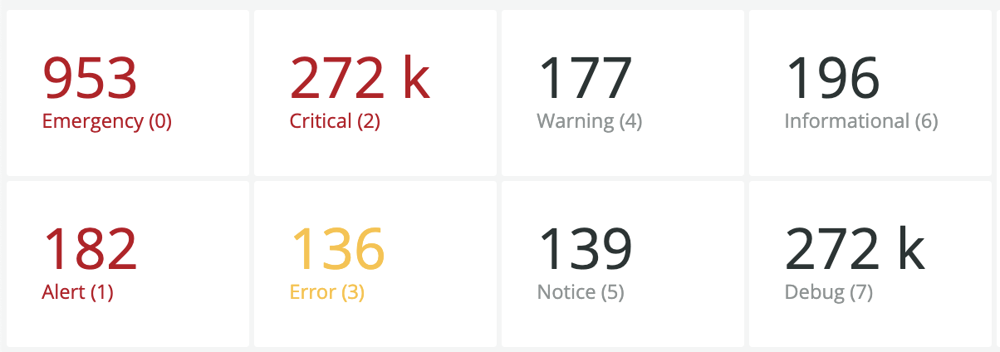
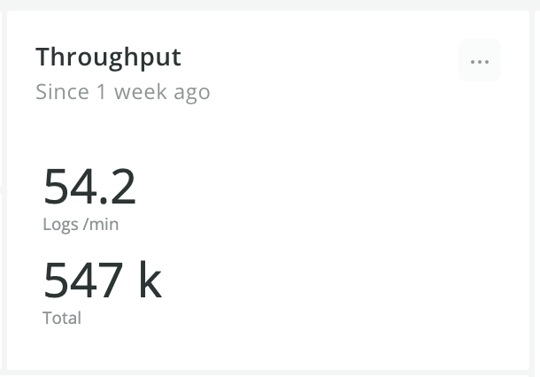
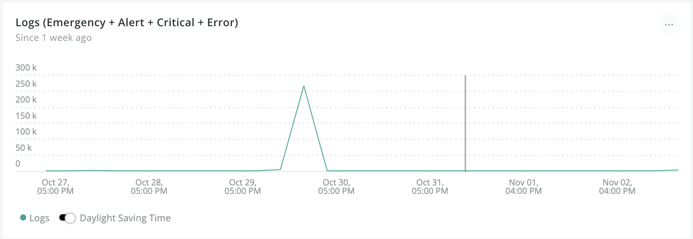
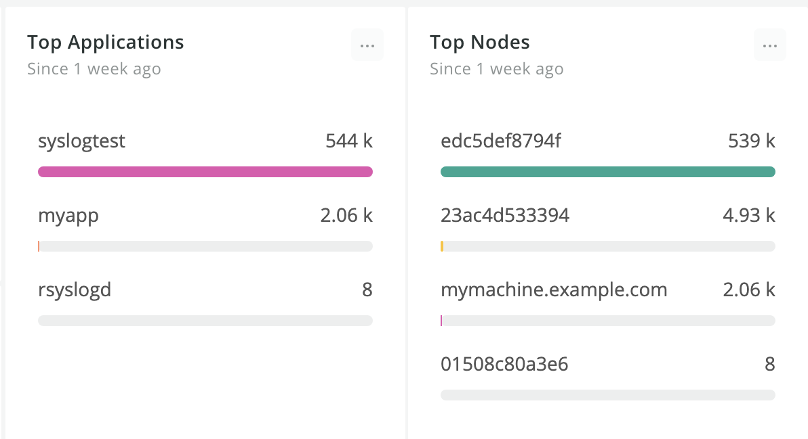
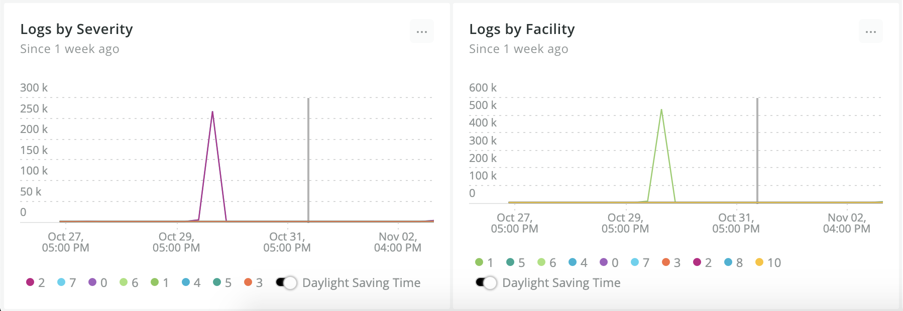
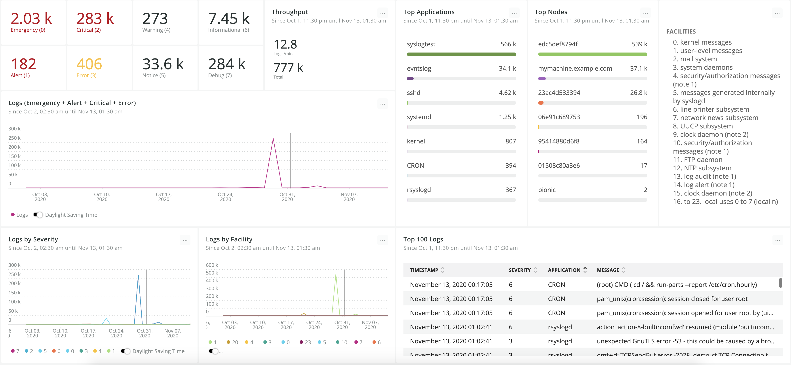

# Dashboards as code: A Syslog dashboard using New Relic and Terraform

New Relic recently released a new built-in log parser rule [syslog-rfc5424](https://docs.newrelic.com/docs/logs/log-management/ui-data/built-log-parsing-rulesets#syslog-rfc5424) which allows [Syslog RFC-5424](https://tools.ietf.org/html/rfc5424#page-9) unstructured messages to be organized into attribute/value pairs and then be used to drive dashboards and alerts based on subsets of log data.

This tutorial will guide you through creating a [Syslog RFC-5424](https://tools.ietf.org/html/rfc5424#page-9) dashboard in the [New Relic Platform](https://newrelic.com/platform) using the new built-in parser rule and observability as code with [Terraform](https://www.terraform.io/).  

But wait! why should we think about dashboard as code and not just creating them using the UI? Dashboards are important tools that help you to understand your applications state providing visual insights and helping you to take actions based on historic data and trends. It also answers questions like "When the problem has started?", "What's the impact of this issue?" and so on. That said, we should treat dashboards like any other important resource, and manually maintaining them is error-prone and non-optimal in terms of efficiency and security, it also does not provide any modification history, rollback mechanisms, peers reviews, and all the benefits we normally get in CI/CD pipelines.


### Understanding the Syslog format

To build this Syslog dashboard, first, we need to understand how the log severities are defined in the [Syslog RFC-5424](https://tools.ietf.org/html/rfc5424#page-9) format.
The [PRI](https://tools.ietf.org/html/rfc5424#section-6.2.1) part is used to represent both the Facility and Severity, this value is calculated by first multiplying the Facility number by 8 and then adding the numerical value of the severity, for example, a security/authorization (facility = 4) with a critical severity (severity = 2) would have a `PRI` value of 34  (```(4 * 8) + 2```). That said, we can now extract the log severity from the ```PRI``` log attribute using the following formula: ```(pri - ((floor(pri)/8) * 8))```.

### Step 1: Creating your Terraform project

Terraform uses its configuration [language](https://www.terraform.io/docs/configuration/index.html) also known as HCL. The main purpose of this language is to describe [resources](https://www.terraform.io/docs/configuration/resources.html) which are used to represent some infrastructure objects. These resources are processed by specific plugins called [providers](https://www.terraform.io/docs/configuration/provider-requirements.html). 

New Relic has an official Terraform provider. It allows users to manage different types of resources such as [dashboards](https://registry.terraform.io/providers/newrelic/newrelic/latest/docs/resources/dashboard), [alert channels](https://registry.terraform.io/providers/newrelic/newrelic/latest/docs/resources/alert_channel) and [alert policies](https://registry.terraform.io/providers/newrelic/newrelic/latest/docs/resources/alert_policy). More information about the Terraform provider can be found on the provider [documention](https://registry.terraform.io/providers/newrelic/newrelic/latest) and in this [Terraform Provider for New Relic - Getting Started Guide](https://youtu.be/UwJ-7BLylJo) quick tip video. 

The first step is to create your project folder, there are different ways of organizing a Terraform workspace, it’s quite flexible and can be adapted depending on the requirements of your project like multiple environments, multiple accounts, and so on. In this example, we will adopt a flat structure for simplicity's sake. 

1. First, create a directory for your project

   ```bash
   mkdir newrelic-syslog-monitoring 
   ```

2. Create a file named ```versions.tf``` in your working directory, this file will be used by Terraform to configure the Terraform client and specify all required providers by the current module. in this case, the `newrelic` provider.

   ```hcl
   terraform {
     required_version = ">= 0.13"
     required_providers {
       newrelic = {
         source  = "newrelic/newrelic"
         version = ">= 2.12.0"
       }
     }
   }
   ```

3. The New Relic Terraform provider requires an [Account ID](https://docs.newrelic.com/docs/accounts/accounts-billing/account-setup/account-id), [Personal Key](https://docs.newrelic.com/docs/apis/get-started/intro-apis/types-new-relic-api-keys#personal-api-key) and [Region](https://docs.newrelic.com/docs/using-new-relic/welcome-new-relic/get-started/our-eu-us-region-data-centers) (`US` or `EU`) to be able to integrate with your account and manage resources. It supports two methods of configuration using [environment variables](https://registry.terraform.io/providers/newrelic/newrelic/latest/docs/guides/provider_configuration#configuration-via-environment-variables) or via [provider block](https://registry.terraform.io/providers/newrelic/newrelic/latest/docs/guides/provider_configuration#configuration-via-the-provider-block). To keep this example simple, the provider block will be used and all required information will be received via [input variables](https://www.terraform.io/docs/configuration/variables.html). For that, create a file named ```variables.tf```:

   ```hcl
   variable "NEWRELIC_ACCOUNT_ID" {
     type    = number
   }
   
   variable "NEWRELIC_API_KEY" {
     type    = string
   }
   
   variable "NEWRELIC_REGION" {
     type    = string
   }
   ```

4. Create a file named ```main.tf``` to be the primary entrypoint for Terraform. The New Relic provider will also be configured in this file using the input variables previously declared in the ```variables.tf``` file:

   ```hcl
   provider "newrelic" {
     account_id = var.NEWRELIC_ACCOUNT_ID
     api_key    = var.NEWRELIC_API_KEY
     region     = var.NEWRELIC_REGION
   }
   ```

   

### Step 2: Creating the Syslog dashboard

All the [dashboard](https://docs.newrelic.com/docs/query-your-data/explore-query-data/dashboards/introduction-new-relic-one-dashboards) data will be retrieved from the ```Log``` datatype using the [NRQL](https://docs.newrelic.com/docs/query-your-data/nrql-new-relic-query-language/get-started/introduction-nrql-new-relics-query-language) query language. To simplify the queries and to avoid repetition, Terraform's [locals](https://www.terraform.io/docs/configuration/locals.html) can be defined to represent the Syslog severity formula and the [logType](https://docs.newrelic.com/docs/logs/log-management/ui-data/logs-parsing-built-rules-custom-parsing#logtype) filter value.

1. Create a file named ```dashboards.tf```, this file will be used to describe the [dashboard](https://registry.terraform.io/providers/newrelic/newrelic/latest/docs/resources/dashboard) resource and its widgets/visualizations:

   ```hcl
   locals {
     syslog   = "syslog-rfc5424"
     severity = "(numeric(pri) - (floor(numeric(pri)/8) * 8))"
   }
   
   resource "newrelic_dashboard" "syslog_dashboard" {
     title             = "Syslog Dashboard"
     grid_column_count = 12
   }
   ```


#### Adding widgets / visualizations

The first step to designing your dashboard is to define what you’re trying to achieve and which visualizations would be helpful for that.  The main goal of this dashboard example is to give you an overview of all your applications healthinesses without the need to deep into tons of log lines searching for problematic severities.

> **Note:** All widget code goes inside the  ```"syslog_dashboard" {...}``` block

##### Billboards counters by severity

The log's severity is one of the most important field available in the Syslog format and will be widely used on this dashboard's visualizations. These billboard charts will show the log counters by severity, colorizing then yellow or red depending on the  `threshold_yellow` and `threshold_red` values. Having these charts should make it easy to see what's happening with your applications and would catch your attention if any problematic log arrives.

As these billboard charts shares almost the same code, you can take advantage of Terrafrom's [dynamic blocks](https://www.terraform.io/docs/configuration/expressions.html#dynamic-blocks) and reuse it iterating over a `severity_billboards` map configuring every widget. For that, add a `severity_billboards` map inside the `locals{...}` block with the following content:

```hcl
locals {
  syslog   = "syslog-rfc5424"
  severity = "(numeric(pri) - (floor(numeric(pri)/8) * 8))"
  
  severity_billboards = tomap({
    "emergency"     = { severity =  0, row = 1, column = 1, threshold_red = 1 },
    "alert"         = { severity =  1, row = 2, column = 1, threshold_red = 1 },
    "critical"      = { severity =  2, row = 1, column = 2, threshold_red = 1 },
    "error"         = { severity =  3, row = 2, column = 2, threshold_yellow = 1 },
    "warning"       = { severity =  4, row = 1, column = 3 },
    "notice"        = { severity =  5, row = 2, column = 3 },
    "informational" = { severity =  6, row = 1, column = 4 },
    "debug"         = { severity =  7, row = 2, column = 4 }
  })
}
```

And then add the widget generic code inside the ```syslog_dashboard" {...}``` block:

```hcl
  dynamic "widget" {
    for_each = local.severities
    content {
      title            = ""
      nrql             = <<-EOF
        SELECT
          count(*) as '${title(widget.key)} (${widget.value.severity})'
        FROM Log
        WHERE logType = '${local.syslog}' AND ${local.severity} = ${widget.value.severity}
      EOF
      visualization    = "billboard"
      width            = 1
      height           = 1
      row              = widget.value.row
      column           = widget.value.column
      threshold_yellow = try(widget.value.threshold_yellow, null)
      threshold_red    = try(widget.value.threshold_red, null)
    }
  }
```

###### Final result




##### Billboard to display the log throughput

This chart will show how the logs total and rate per minute your applications are sending.

```hcl
  widget {
    title         = "Throughput"
    nrql          = <<-EOF
      SELECT
        rate(count(*), 1 minute) as 'Logs /min',
        count(*) as 'Total'
      FROM Log 
      WHERE logType = '${local.syslog}' SINCE 1 hour ago
    EOF
    visualization = "attribute_sheet"
    width         = 2
    height        = 2
    row           = 1
    column        = 5
  }
```

###### Final result




##### Line chart to view problem-related trends over time

This chart will count up all logs with severity equals to `Error(3)`, `Critical(2)`, `Alert(1)` or `Emergency(0)`  and display it over time, spikes on this graph means you may have problems with your applications and some actions should be taken to resolve it.

```hcl
  widget {
    title         = "Logs (Emergency + Alert + Critical + Error)"
    nrql          = <<-EOF
      SELECT
        count(*)
      FROM Log
      WHERE logType = '${local.syslog}' AND ${local.severity} < 4
      TIMESERIES AUTO
    EOF
    visualization = "line_chart"
    width         = 6
    height        = 3
    row           = 3
    column        = 1
  }
```

###### Final result




##### Bar charts by Application and Nodes

These charts will show the number of logs by application and hostname, it also can be configured to [filter](https://docs.newrelic.com/docs/query-your-data/explore-query-data/dashboards/filter-new-relic-one-dashboards-facets) the current dashboard just clicking on the application/hostname bars.

```hcl
  widget {
    title         = "Top Applications"
    nrql          = <<-EOF
      SELECT
        count(*)
      FROM Log
      WHERE logType = '${local.syslog}'
      FACET app.name
    EOF
    visualization = "facet_bar_chart"
    width         = 2
    height        = 8
    row           = 1
    column        = 7
  }

  widget {
    title         = "Top Nodes"
    nrql          = <<-EOF
      SELECT
        count(*) as 'Logs'
      FROM Log
      WHERE logType = '${local.syslog}'
      FACET hostname
    EOF
    visualization = "facet_bar_chart"
    width         = 2
    height        = 8
    row           = 1
    column        = 9
  }
```

###### Final result




##### Line charts to view log counters by Severity and Facility over time

The idea behind these charts is to display how many logs by severity and facility your applications are sending over time, this way you can easily detect spikes of any severity or facility knowing when they started and stopped to happen.

```hcl
 widget {
    title         = "Logs by Severity"
    nrql          = <<-EOF
      SELECT
        count(*)
      FROM Log
      WHERE logType = '${local.syslog}'
      FACET string(${local.severity}) as 'Severity'
      TIMESERIES AUTO
    EOF
    visualization = "faceted_line_chart"
    width         = 3
    height        = 3
    row           = 6
    column        = 1
  }

  widget {
    title         = "Logs by Facility"
    nrql          = <<-EOF
      SELECT
        count(*)
      FROM Log
      WHERE logType = '${local.syslog}'
      FACET floor(numeric(pri)/8) as 'Facility'
      TIMESERIES AUTO
    EOF
    visualization = "faceted_line_chart"
    width         = 3
    height        = 3
    row           = 6
    column        = 4
  }
```

###### Final result




##### Markdown summary for Syslog Facilities

```hcl
 widget {
    title         = ""
    width         = 2
    height        = 8
    row           = 1
    column        = 11
    source        = <<-EOF
    ### Facilities
    0. kernel messages
    1. user-level messages
    2. mail system
    3. system daemons
    4. security/authorization messages (note 1)
    5. messages generated internally by syslogd
    6. line printer subsystem
    7. network news subsystem
    8. UUCP subsystem
    9. clock daemon (note 2)
    10. security/authorization messages (note 1)
    11. FTP daemon
    12. NTP subsystem
    13. log audit (note 1)
    14. log alert (note 1)
    15. clock daemon (note 2)
    16. local use 0  (local0)
    17. local use 1  (local1)
    18. local use 2  (local2)
    19. local use 3  (local3)
    20. local use 4  (local4)
    21. local use 5  (local5)
    22. local use 6  (local6)
    23. local use 7  (local7)
    EOF
    visualization = "markdown"
  }
```


#### Final dashboard overview




### Step 3: Applying your code

Terraform client can be installed either by downloading the binary from https://www.terraform.io/downloads.html or using your operating system's package manager, more instructions on how to install Terraform in different environments can be found [here](https://learn.hashicorp.com/tutorials/terraform/install-cli).


Once installed the Terraform client, run the following command in your working directory:

```shell script
terraform plan -var NEWRELIC_ACCOUNT_ID=<YOUR-ACCOUNT-ID> -var NEWRELIC_API_KEY=<YOUR-API-KEY> -var NEWRELIC_REGION=<US or EU>
```

The `terraform plan` command is used to create an execution plan and then determines what actions are necessary to achieve the desired state specified in the configuration files, in this case, your dashboard resource will be added. 

Finally, run the following command to apply all pending actions and create the resources in the [New Relic platform](https://newrelic.com/platform):

```shell script
terraform apply -var NEWRELIC_ACCOUNT_ID=<YOUR-ACCOUNT-ID> -var NEWRELIC_API_KEY=<YOUR-API-KEY> -var NEWRELIC_REGION=<US or EU>
```


#### What's next?

Terraform uses [states](https://www.terraform.io/docs/state/index.html) to map your local resources to the real world, when you have a declared resource like `resource "newrelic_dashboard" "syslog_dashboard"` in your files, Terraform uses this map to know that the New Relic Dashboard ID `1234 ` is represented by that resource. That said, if you apply this project in different machines without sharing the state, Terraform will recreate all resources instead of updating them. Setting up a [remote](https://www.terraform.io/docs/backends/types/remote.html) state would solve this issue.

HashiCorp offers a [Terraform Cloud](https://www.hashicorp.com/products/terraform/) solution that helps teams use Terraform together out of the box. It's also possible to use [Atlantis](https://www.runatlantis.io/) which is an amazing tool to automate Terraform via pull requests taking your observability as code to the next level.


### Step 4: To Infinity... and Beyond!

Although dashboards are wonderful tools for helping in problem detection and troubleshooting, you probably can't watch it 24 hours a day, it is not efficient and you can easily miss some important logs. To making monitoring easier, New Relic provides an amazing set of [alerts](https://newrelic.com/platform/alerts) that will definitely help you to solve your application issues faster and with less noise before they turn into critical incidents. It also supports third-party integrations such as [PageDuty](https://www.pagerduty.com/) and [Slack](https://slack.com/) making the notification process very efficient and adaptable to your team needs.

The New Relic Terraform provider supports all required alerting resources to monitor your Syslog applications. It is possible, for example, to create different [alert channels](https://registry.terraform.io/providers/newrelic/newrelic/latest/docs/resources/alert_channel) per team, responsibility, node, or application notifying different people in different ways when applications are reporting errors.

For this specific example, we could reuse the dashboard queries and define the following [NRQL alert conditions](https://registry.terraform.io/providers/newrelic/newrelic/latest/docs/resources/nrql_alert_condition):

- A static threshold alarm for critical severities `Error(3)`, `Critical(2)`, `Alert(1)` and `Emergency(0)`.
- [Baseline](https://docs.newrelic.com/docs/alerts-applied-intelligence/new-relic-alerts/alert-conditions/create-baseline-alert-conditions) alarm in [upper](https://docs.newrelic.com/docs/alerts-applied-intelligence/new-relic-alerts/alert-conditions/create-baseline-alert-conditions#upper-lower) direction for log counters with `severity < 4` to detect abnormal unhealthy spikes.
- What else? The possibilities are huge and it depends on your environment and system characteristics, maybe a static alert for logs with `severity < 4` and facility equals to `security/authorization messages(4)` sending all notification messages to the `#security-team` slack channel would be better for you than sending it to every people in the office. All in all, the New Relic alerting system is quite flexible and does support complex scenarios you might have. 


If you are interested in learning more about New Relic alerts please visit our alert [documentation](https://docs.newrelic.com/docs/alerts-applied-intelligence/new-relic-alerts/get-started/introduction-alerts). For more information about New Relic alerts with Terraform, please check this [blog post](https://blog.newrelic.com/engineering/observability-as-code-new-relic-terraform-provider/) out. 

All the code used in this example can be found in this [GitHub repository](https://github.com/edmocosta/newrelic-syslog-monitoring). If you don't want to use Terraform but would like to try the dashboard out you can import it coping this [JSON file content](https://github.com/edmocosta/newrelic-syslog-monitoring/blob/master/dashboard.json) replacing the `<YOUR_ACCOUNT_ID>` placeholder by your [Account ID](https://docs.newrelic.com/docs/accounts/accounts-billing/account-setup/account-id) and then importing it into New Relic using the UI (`Dashboard > Import dashboard`) option.
